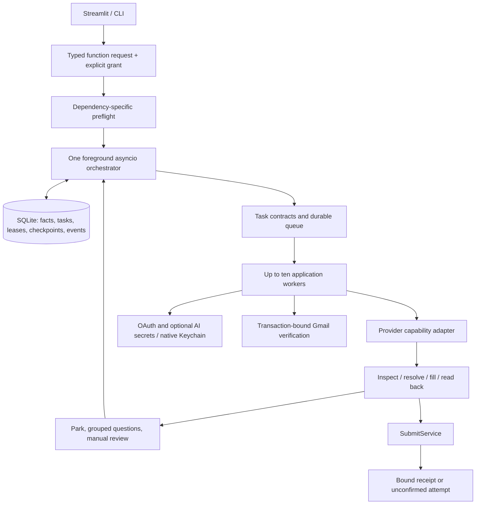

# Local architecture and authority



`models.py` parses `FIND_JOBS`, `LINKEDIN_EASY_APPLY`, `AUTOFILL` and
`OPEN_JOB_LINKS`. Autofill targets independently carry `REVIEW` or `SUBMIT`;
legacy workflow fields are normalized only by the compatibility parser. The
model does not infer permission from prose, a page or a model. `preflight.py`
separates common failures from per-target needs. `runtime.py` owns Playwright
objects in one event loop, scheduling and resume/handoff. `tasks.py` binds
durable task kinds to their required capability and postcondition.

`store.py` owns migrations, immutable candidate versions, discovery results,
LinkedIn batches, constraints, global slot reservations, account/context locks,
fencing, checkpoints and events. Every writer uses the same SQLite file.
Transactions finish before browser/model/mail waits. `resources.py` owns
approved documents, the read-only legacy preview/import path and disposable
caches. `engine.py` is shared by Autofill and LinkedIn; `records.py` implements
adapter-owned Add/Save reconciliation. `adapters.py` distinguishes capabilities
and identity/receipt evidence.

`submission.py` is the sole final-transmission path. It persists intent before
transmitting and validates target-scoped authority, identity, current files and
adapter qualification. Lost responses remain unconfirmed. New function requests
never read or store employer passwords. `discovery.py` performs a bounded crawl
of Bright Network, registered priority ATS roots and supplied sources, following
only permitted same-site vacancy links. It filters by the requested job area and
persists normalized fields plus a CHECK PORTAL summary. `linkedin.py` prepares separate Easy Apply tabs and
serializes them through the signed-in account; it never grants final submission.

## Persistence and scheduling

One OS file lock owns the foreground runtime. The Unix socket is 0600. Database transactions reserve global slots 1–10, application ownership and account/context locks. Leases renew every five seconds with a 30-second horizon; a stale owner cannot authorize a new side effect. Startup reconciliation runs only after acquiring the OS lock. It never treats lease expiry as proof that a remote operation failed.

Browser contexts and active workers are different counts. Parked forms keep their contexts while freeing execution slots. Queue admission respects the ten-context ceiling. User-reported submission advances the fencing number, completes queued tasks and clears questions, so late worker results cannot undo completion.

First-run readiness is checked only for application-changing functions. It
requires reusable contact details, education/work-history decisions,
country-scoped work rights, reusable screening answers and an approved CV.
Salary, consent, declarations and later conditional questions remain
application-specific.

The versioned public question catalogue stores blank definitions, categories,
matching phrases, answer shapes, reuse scope and ask timing. Only entries marked
`setup_required` participate in readiness. Optional reusable answers stay
unknown until confirmed. Country-specific, employer-specific, salary,
declaration, signature and sensitive voluntary-disclosure answers are never
supplied from the public catalogue. When more than one definition matches, the
most specific set of phrases wins so similar-looking questions are not merged.

The durable state constraints protect completed and uncertain submission states. A new profile version reconciles only affected applications and downgrades their existing submission approval to review. Model requests have a separate two-request semaphore, 30-second timeout and 60-request runtime budget. Form operations use 15-second control limits and a bounded 180-second execution slice; navigation and unchanged-page detection produce explicit incomplete results.

The repository-owned pre-push hook runs `scripts/privacy_gate.py`. It scans
tracked and staged content, filenames, reachable Git blobs and commit messages
against local candidate identifiers and credential/document patterns. Matches
block a push without printing the matched value.

## Cache invalidation matrix

| Derived value | Key | Expiry/invalidation |
|---|---|---|
| Narrative draft | Profile version, employer, role, exact question, limits, source facts, prompt/model version | One hour; key changes with content; employer policy and grant checked before use |
| Document extraction | Content hash + parser version | Caller-selected TTL; changed file cannot reuse old extraction |
| Employer research | Explicit source identity/version + checked time | Caller-selected TTL; refresh before relying on current vacancy facts |

Memory cache holds up to 64 entries; SQLite cache is bounded to 32 MiB. Concurrent misses coalesce. Confirmed facts, approved files, grants, attempts and receipts never enter the disposable cache. Document previews use the extraction cache; permitted public source retrieval uses a 60-second research cache; narrative generation uses the draft cache. There is no vector database, Redis or cloud backend.

## Qualification and evidence

Qualification is per adapter and final-transmission capability. A synthetic test establishes only the tested DOM/provider contract. A separately authorised supervised acceptance can run with `supervised_acceptance: true` after its synthetic qualification is recorded. Unattended use additionally requires an explicit UNATTENDED record. Code/portal changes require renewed qualification. No real unattended submission is live-qualified by this development run.

```bash
.venv-upgrade/bin/python cli.py runtime qualify --adapter workday --level SYNTHETIC --evidence /absolute/path/to/output/upgrade-validation/report.json --confirm
```

Use SUPERVISED/UNATTENDED only after the corresponding real evidence and explicit user authority exist. Do not use invented candidates on real portals. The capability matrix lists the current limits.

Qualification evidence is hashed and bound to the current `src/pilot` implementation. SYNTHETIC accepts the successful local CI JSON report for the named workflow. SUPERVISED requires a JSON object with `application_id` and `receipt_reference` matching a persisted supervised portal receipt. UNATTENDED requires the preceding supervised qualification plus explicit confirmation. Editing evidence or code invalidates availability.

The filling boundary suppresses native/implicit form submission and rejects unclassified network writes while the engine is active. A document transmission is permitted only to a same-origin upload/file/attachment endpoint with bytes matching an approved document (raw payload or a single-file multipart payload with supported CSRF metadata). Named provider save actions may transmit a checked form payload to its existing endpoint; unclassified save APIs and redirects require handoff. Browser guards are restored at handoff so the applicant can submit manually. This conservative endpoint contract is not universal certification of arbitrary third-party JavaScript.

## Local reliability and complete recovery

Opportunity pages use checked-time/identity keyset cursors. Saved/opened predicates are applied before paging; expiry and application-state predicates are evaluated before filling the result page. Assessment identity is scoped to the application plus normalized component label or an explicit test/round key. Multiple messages attach through assessment_evidence without resetting completion; ambiguous historical duplicates stay separate for review.

Mail tracking distinguishes last_page_success from last_success (fully caught up). A one-page continuation becomes due after 30 seconds, with bounded retry backoff for transient errors. Normal polling remains daily after catch-up.

EvidenceVault persists a stable native secret reference in workspace_settings, retaining the legacy derived reference on first upgrade. Complete offline recovery packages the database, hash-checked documents and the evidence key inside an authenticated encrypted bundle. Restores target a new workspace and new key mapping, pause runs and revoke grants while preserving uncertain attempts. See [RECOVERY.md](RECOVERY.md) for commands and limitations.

Automatic recovery is another foreground-runtime task. It creates per-workspace key material locally, performs consistent online SQLite snapshots on a separate connection, verifies archive contents without creating restored Keychain items, and retains seven successful local bundles. The main event loop persists status in workspace_settings. Cancellation waits for an in-flight bounded snapshot before closing the database. Optional additional-copy paths are explicitly configured, never created at missing mount points, and never receive the recovery key. No OS daemon or off-device replication claim is implied.
