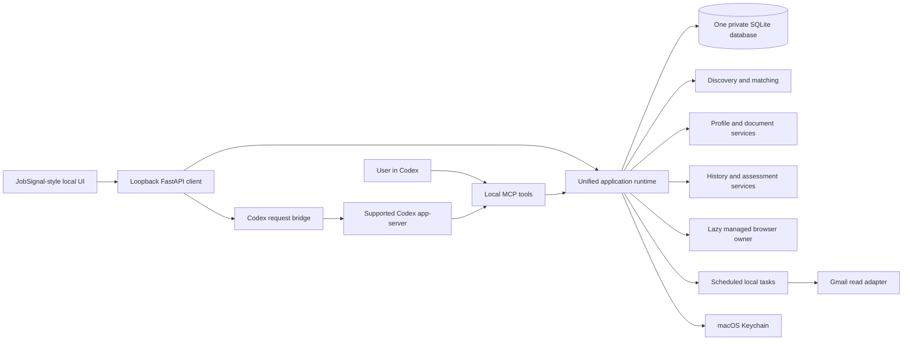

# Unified local JobSignal and ApplyPilot plan

Status: design specification, amended 12 September 2026 to daily Gmail checks. The implemented local release and its exact boundaries are documented in LOCAL_WORKSPACE.md. This document does not activate a mailbox connection or authorize a live data import.

## 1. Product decision and confirmed preferences

Build one private local job workspace in the existing ApplyPilot repository. Use JobSignal's sidebar, search portfolios and job-card design. Add **My Information** immediately beside **Search Portfolios**, durable **Applied History**, and assessment tracking inside each application. Gmail synchronization is opt-in, every 24 hours while the Mac is awake, with **Sync now**.

The main interface remains a browser-rendered local application at a loopback address. It is not deployed as a public website. A launcher opens the local window and manages its processes. A native desktop wrapper can follow later; replacing Streamlit does not require one.

Use the JobSignal FastAPI/static interface as the single main UI and port ApplyPilot's profile/document/autofill controls into it. Retire Streamlit from the normal launch path after feature parity. Both browser UI and Codex tools use the same service contracts; neither becomes a separate profile or application ledger.

Remove the existing **Email alerts** page, its sidebar entry, discovery-card email promotions, receiving-address verification and SMTP delivery controls from this local product. Do not migrate enabled outgoing-email schedules. **Settings → Gmail tracking** controls inbound employer messages. Local reminders can be added under Settings after tracking is reliable. Sending email is a separate future capability, not implied by enabling Gmail read access.

## 2. Verified starting point

| Component | Observed implementation | Reuse or change |
|---|---|---|
| ApplyPilot | Foreground asyncio runtime, Unix socket, SQLite migrations 001–004, document registry, profile versions, checkpoints, application states, submission boundaries | Keep as the execution and storage foundation |
| ApplyPilot UI | Streamlit at port 8501; profile setup edits the first education/work record and exposes the 66-question catalogue | Replace with complete profile editors in the JobSignal-style UI |
| JobSignal | FastAPI/static HTML, CSS and JavaScript; portfolios, cards, matching, saved jobs, discovery workers, optional Brave search | Port reusable UI, collectors and matching into the unified services |
| JobSignal local preview | Running at port 8000 with a demo identity and public programme previews; broad web discovery reports missing provider configuration | Never treat the demo identity as the real local owner or the preview as a completed general search |
| Applied action | JobSignal already has a Mark applied button inside expanded card details and a saved/applied/hidden state | Promote to a visible action and create a durable application record |
| Expiry | JobSignal retention deletes saved associations, notes and job details when a vacancy expires | Replace before importing application history |
| Gmail | ApplyPilot has Desktop OAuth, Keychain-backed refresh credentials and transaction-specific verification helpers | Reuse authentication; build application-mail synchronization and assessment lifecycle separately |
| Codex | Local CLI 0.153.2 advertises MCP configuration and app-server interfaces | Validate a narrow integration against this installed version |
| Git | ApplyPilot baseline e31fb9b; JobSignal baseline a11b052 with uncommitted changes in collectors.py and models.py | Preserve both source snapshots and local changes before integration |

Evidence reviewed: both READMEs, JobSignal's current browser UI, static UI, settings, models, discovery and retention code; ApplyPilot's runtime, profile storage, onboarding, UI and Gmail implementation. Prior recorded validation is 170 ApplyPilot tests plus six subtests, and JobSignal's documented 259 local passes with ten PostgreSQL-only skips. These are separate baselines, not a merged-product test result.

## 3. Target navigation and user journeys

| Section | User-facing purpose |
|---|---|
| Discover Jobs | Search by request or portfolio; show source evidence, requirements, dates, pay, matching reasons and visible application actions |
| Search Portfolios | Save multiple career directions, countries, locations, opportunity types and preferences |
| My Information | Store the owner's complete reusable information, documents, answers, provenance and unresolved facts |
| Saved Opportunities | Shortlist jobs without implying an application was submitted |
| Autofill | Fill selected applications; include LinkedIn Easy Apply as a clearly labelled function; default to final review |
| Applied History | Track applications, outcomes, notes, employer messages and assessment components over time |
| Discovery Status | Explain search sources, verified results, blocked pages, last successful check and next action |
| Settings | Codex connection, Gmail tracking, local reminders, backup/export, privacy controls and runtime health |

**Discover → Applied:** each job card shows Open official page, Save, Autofill and **I applied**. Opening a page records only Opened. Clicking I applied records user-reported submission immediately; the date defaults to now and can be corrected. No receipt wait or second generic confirmation is needed. An ambiguous job or account identity must be resolved first.

**Chat → Applied:** a request such as “I applied to Example Employer's graduate programme” searches the local vacancy/application index. A unique match creates the same event as the UI. Several programmes, locations or cycles trigger one focused clarification. Return a link to the updated local record.

**Outside application → History:** Add application accepts employer, role, country/location, programme cycle, optional requisition, portal URL and application date. Unknown fields remain unknown. It can exist without a discovery listing, CV or complete profile.

**Email → Assessment:** a matched invitation adds an assessment card within its application's history row. The card shows provider, component, received date, raw and interpreted deadline, evidence source, current state, Open Gmail, Open assessment and I completed it. It also contributes to a history-wide Due soon view.

**Correction:** Undo/correct adds an event; it does not delete evidence or automatically resume autofill. An accidentally reported submission can be corrected after reconciling the portal. A new attempt still requires an explicit action.

## 4. My Information and reusable knowledge

The workspace has an explicitly selected owner and active profile version. Do not use “latest profile in the database” across owners. A fresh local installation begins empty, while existing confirmed records can be imported once through a reviewed mapping.

Support the following groups with add/edit/remove controls and stable record IDs:

- Identity and contact: legal/preferred names, title, email, phones, addresses, contact preferences and relevant public links.
- Education: multiple institutions and qualifications, subjects, achieved/predicted classifications, date precision, modules and school-level results.
- Employment: all work, placements, volunteering and relevant responsibilities, locations, dates and gaps; explicit none is distinct from missing.
- Work rights: permission and present/future sponsorship by destination country, expiry and relevant programme dates. Nationality, permission and sponsorship are separate facts.
- Skills, languages, certifications, memberships, awards, projects and evidence used for application answers.
- Availability and preferences: start date, notice, role areas, relocation, travel, work arrangements and driving-licence jurisdiction/category where relevant.
- Documents: approved CVs, transcripts, cover letters and writing samples with file hashes, applicability and versions. Use a file picker and local preview rather than requiring raw paths.
- Screening: all current catalogue definitions, plus employer-specific answers and newly encountered questions. Each answer retains exact wording, options, country, employer, time scope and provenance.
- Private custom information: typed custom fields and notes with explicit scope. Referee information is restricted to applications that require it.

Every fact has a value, confirmation state, source, confirmation time, record ID, scope and version. Preserve Unknown, No, Not applicable, Not provided and Prefer not to disclose distinctly. Do not lose Boolean false through string conversion, or discard existing choice values when a catalogue label changes. Validate without silently rewriting.

Keep existing confirmed information. New CV extraction, a portal edit or a chat statement can propose additions, but conflicting facts are shown together. A single explicit user request to save a fact is sufficient authority; extracted suggestions use one grouped confirmation. Newly supplied application answers remain scoped to the application unless reusable storage was also approved.

Search portfolios reference the common profile and add preferences, rather than keeping competing personal biographies. Portfolio-specific overrides are visible and do not overwrite confirmed facts. Profiles and search filters can change without altering historical application snapshots.

Revise onboarding during the merge. Discovery, history and mailbox tracking should not require an approved CV. Autofill requires only the facts and documents needed for its target. Financial-integrity, demographic and other sector-specific questions remain available in the catalogue but should not be compulsory for every new user. Salary is asked only when required by the portal. Declarations and signatures remain tied to the completed application.

The catalogue is broad coverage, not a promise to anticipate every employer's wording. Unknown questions join the existing grouped question service. Similar questions with different thresholds, countries, record identities, dates, options or consent notices stay separate.

## 5. Local architecture

One launcher starts the API and the singleton application runtime. The runtime owns authoritative writes through typed commands over its user-restricted Unix socket. UI, plugin and scheduler are clients of those commands. Existing JobSignal direct database writes must be ported, not run against a second writable ledger.

Store authoritative data beneath the existing per-user Application Support location, outside the Git checkout and cloud-synchronized folders. Keep document files in a managed private directory or explicitly approved external locations. SQLite uses the tested APSW runtime, foreign keys, numbered migrations, short transactions and consistent backup/restore.

Make the browser optional at startup. Load/connect the browser only for opening pages or filling applications. Profile editing, saved results, manual history, Gmail sync and local reminders continue with all employer tabs closed. A stopped browser produces a target-specific handoff.

Retain the ten-worker and ten-retained-context caps, account serialization, submission serialization, leases, fencing and operation deadlines. Run synchronous source extraction off the event loop through bounded executors; return results to runtime-owned write commands. No database transaction stays open during network or model waits.

Replace the stale-runtime workaround with a protocol handshake: server build, schema version, supported commands and feature availability. The UI gives a correct restart/migration action instead of a traceback. A supervised restart preserves queued tasks, completed states and uncertain external effects. Do not automatically restart a process during an unresolved submission.

The launcher uses loopback binding, random local session/bootstrap credentials, Host/Origin checks and CSRF protection. It shows an active profile and saves without requiring Google website login. Loopback alone does not authenticate another local process. Optional extra workspaces use separate owner/database roots.

## 6. Codex integration and discovery

There are two directions of integration:

1. **Use this Codex conversation:** a local MCP server exposes narrow workspace tools. Codex retrieves only the context needed for the current user request and records approved changes through the runtime. Package the server with a reusable skill as a local plugin after the contract is tested. Official documentation supports command-launched local MCP servers and configuration shared by local Codex clients. [OpenAI MCP documentation](https://learn.chatgpt.com/docs/extend/mcp?surface=cli)
2. **Request discovery inside the dashboard:** the backend sends a bounded structured request to a supported Codex app-server instance and displays its progress, result and any needed approval. Validate authentication, cancellation, session isolation and installed-version support in a compatibility spike. The documented app-server interface supports custom clients with authentication, approvals, history and streamed events. [OpenAI app-server documentation](https://learn.chatgpt.com/docs/app-server)

The dashboard is not an API endpoint for this exact chat. It must not scrape Codex's private files, reuse hidden app credentials or assume that unrelated conversations are available. A dashboard task gets a workspace-linked conversation identifier. Durable approved facts and structured request summaries form shared memory; selected chat facts are deliberately saved through tools. Do not import entire chat histories automatically.

Codex runs through the user's supported sign-in and available service access. Record capability failures and quota limits without exposing credentials. Do not promise that another API endpoint inherits Codex subscription billing. A separately chosen OpenAI API backend requires its own configuration. A Codex SDK is an alternative for bounded programmatic jobs, not a replacement name for the app-server interface. [OpenAI Codex SDK documentation](https://learn.chatgpt.com/docs/codex-sdk)

Local storage and orchestration do not mean the selected Codex model runs offline. Profile fields supplied to Codex become model context. Discovery should normally send only career criteria and relevant qualification summaries; names, contact information, sensitive answers, private document contents and tokenized URLs are excluded. Show the disclosure scope and require an explicit grant for additional fields. Default mailbox classification stays local.

**Discovery pipeline:** user request or saved portfolio → structured criteria and limits → candidate URLs from Codex search, registered sources or an optional configured provider → bounded public-page verification → deterministic requirements/matching → persistent result cards. The model proposes and explains; official page evidence controls factual dates, requirements and opening status. Never invent links or treat an LLM assertion as a verified vacancy.

Retain 1–100 requested results, current permitted-root/detail budgets, source rate limits and separate model/request budgets. Return fewer results if evidence or filters are insufficient. Reuse fingerprints and cached public observations; profile-only changes rematch stored vacancies rather than repeating a web sweep. Exclude the owner's reported/confirmed applications by default and provide Show applied.

Codex search is the preferred interactive provider for the proposed product. Keep supplied pages and registered employer collectors useful when it is unavailable. Brave remains optional rather than a required paid dependency. Availability of web search through the chosen Codex integration must be demonstrated, not inferred from the existence of a chat box.

## 7. Durable applied history and assessment states

Keep three independent state dimensions:

| Dimension | Example states | Invariant |
|---|---|---|
| Application execution | Draft, Filling, Needs information, Review ready, Submission unconfirmed, Submitted user reported, Submitted confirmed | A submitted application never restarts filling because an assessment arrives |
| Recruitment outcome | Awaiting response, Assessment stage, Interview, Offer, Rejected, Withdrawn, Closed | Changes require an attributable event; vacancy expiry is not rejection |
| Each assessment component | Detected, To do, In progress, Completed user reported, Completed confirmed, Cancelled, Needs review | Invitations and opened links do not prove completion |

Track overdue as a computed indicator from the deadline and completion state; do not overwrite the event history when time passes. Multiple tests and retakes receive separate IDs linked to the same application. Completing one component does not complete the rest.

The I applied command atomically creates or finds the application, captures its vacancy/profile/document snapshot, appends a user-reported event, completes pending filling work, fences stale workers and reserves the identity against duplicate applications. It does not wait for Gmail. Later matched receipt evidence can add confirmation without changing the original reported date.

Separate shortlist selection from application state. Unchecking Save or removing a saved opportunity never removes Applied History. Closed or deleted vacancy listings lose their discovery visibility while the minimal application snapshot, requirements relied upon, dates, notes and follow-up tasks remain. Historical URLs may stop working; label their last verification honestly.

Identity uses employer tenant, requisition, location/cycle and candidate owner. Where no stable requisition exists, use a reviewed fallback with aliases; fuzzy title similarity suggests possible duplicates without merging them automatically. Correcting duplicates keeps both source references and the event trail.

## 8. Gmail assessment and outcome tracking

Connection belongs to the local owner under Settings. Reuse the Desktop OAuth flow with system-browser consent, PKCE/state protection, account verification, Keychain refresh credentials, Disconnect and Revoke. A Gmail connection available in Codex is not automatically a credential available to the local application. Gmail read-only scope permits broad mailbox reading; any recruitment-only filter is implemented by the app, not enforced by that scope. [Google Desktop OAuth](https://developers.google.com/identity/protocols/oauth2/native-app), [Gmail scope documentation](https://developers.google.com/workspace/gmail/api/auth/scopes)

Sync design:

1. Choose mailbox, earliest import date and optional recruitment label/filter; propose a bounded 90-day initial lookback rather than silently scanning all mail.
2. Retrieve candidate message IDs and needed metadata. Fetch bodies only for likely recruitment messages. Never load remote email images or execute email HTML.
3. Parse submission acknowledgements, invitations, deadline changes, completion acknowledgements, interviews and outcomes locally. Store message/account IDs, a minimal evidence excerpt and private link references rather than a permanent mailbox mirror.
4. Match using mailbox recipient/aliases, employer/ATS/provider mapping, requisition/application reference, role, cycle and timing. A shared provider domain or employer name alone is insufficient. Ambiguous messages enter Unmatched updates for one user decision.
5. Commit evidence, application/assessment events and synchronization progress atomically. Dedupe by mailbox and message ID, with separate invitation/component identity. Advance cursors only after successful processing of the relevant changes.
6. Use Gmail history for incremental synchronization; recover an expired history cursor with a bounded reconciliation and existing deduplication. [Gmail synchronization guide](https://developers.google.com/workspace/gmail/api/guides/sync)
7. Refresh dashboard counts after committed changes. Show Last successful sync, Next check, Offline, Reconnect required and remaining backlog accurately.

Run every 24 hours while the local worker is active and the Mac is awake. Sync now shares the same mailbox lease so it cannot overlap a scheduled run. Retry transient failures with backoff/jitter; an expired consent does not delete existing history. After sleep, perform one catch-up run, not a burst for every missed interval.

This is near-real-time polling, not an instantaneous guarantee. A sleeping/offline Mac cannot receive local updates until it resumes. Google recommends polling for installed clients; Gmail push uses Cloud Pub/Sub and adds a cloud dependency, so it is outside the first local release. [Gmail push documentation](https://developers.google.com/workspace/gmail/api/guides/push)

Preserve raw deadline text alongside normalized time, timezone, anchor email and confidence. “Three working days” needs the applicable calendar and start-day rule; unresolved cases show Check portal. Date-only deadlines must not invent a time. Distinguish invitation deadline, test timer and programme closing date.

Do not automatically open assessment links: opening can start a timed test. Store token-bearing URLs as private encrypted values with Keychain-managed keys and redact them from logs/model context. Open Gmail provides access to the original evidence; email deletion later does not erase the recorded application event. I completed it immediately records user-reported completion for the selected component. A later matching completion notice may confirm it.

No assessment answering, mailbox sending, marking mail read or employer account operations are part of this tracking feature. Gmail-to-model processing, if added, needs a separately reviewed Google-data-policy and field-disclosure path.

## 9. Local schedules and reminders

Persist job type, owner, interval/timezone, enabled flag, last success, next due, lease and bounded retry count. The scheduler belongs to the runtime, not Streamlit reruns, browser JavaScript or an open Codex conversation.

Once enabled, Gmail checks continue when the dashboard tab closes as long as the local worker runs. A visible Start at login option can later install a user-owned macOS LaunchAgent; it stays disabled until explicitly chosen. Do not require a browser session to schedule mailbox work. Show whether the worker is actually running.

Local dashboard reminders and optional macOS notifications can announce new assessments and approaching deadlines with per-event deduplication and quiet hours. Sensitive employer/role details can be hidden in notifications. Outgoing SMTP/email alerts remain removed from this release. No actual schedule is installed by this plan.

## 10. Data and interface contracts

Extend ApplyPilot through new migrations following 004; reserve exact numbers only when implementing against the then-current head.

| Entity | Purpose |
|---|---|
| workspace_owner / active_profile | Explicit local owner and current profile selection |
| profile_versions / profile_records | Canonical reusable facts and repeated records, retaining existing version lineage |
| fact_proposals / answer_versions | Unconfirmed extracted facts and exact scoped answers |
| search_portfolios | Preferences, profile reference and explicit overrides |
| discovery evidence / vacancy_aliases | Unified source observations, identity mappings and freshness |
| shortlist | Saved selection independent of application status |
| applications / application_snapshots | Durable applications, including manually entered applications and historical vacancy facts |
| application_events | Append-only, attributable changes and corrections |
| assessments / assessment_events | Separate components, attempts, deadlines, evidence and completion |
| mail_sync_state / mail_evidence | Mailbox cursor, dedupe keys, minimal evidence and matching decisions |
| unmatched_updates | Ambiguous emails and suggested application mappings |
| schedules / reminder_deliveries | Local tasks, catch-up state and deduplicated notifications |
| codex_jobs / context_grants | Request state, selected conversation reference, input scope and model-use limits |
| import_manifest | Original source identities, hashes, counts, mapping decisions and rollback checkpoint |

Use foreign keys, owner checks, unique identity/idempotency constraints and revision-based conflict detection. Long-lived application history has no cascade from disposable discovery content. Private evidence payloads are distinct from value-free operational logs.

Representative typed commands, shared by UI/CLI/MCP:

| Command | Boundary |
|---|---|
| profile.get_context(fields, purpose), profile.propose, profile.confirm | Selected owner, explicit fields, expected version and reusable scope |
| portfolios.save, discovery.request, discovery.results | Structured filters, request budget and verified source records |
| jobs.save, jobs.open, applications.mark_applied | Stable vacancy ID and idempotency key; Open never calls mark_applied |
| applications.add_manual, applications.history, applications.correct | User-reported source, explicit identity and attributable corrections |
| autofill.start, autofill.resume, autofill.stop | Existing target grants, profile/document versions and submission policy |
| assessments.list, assessments.mark_complete | Application/component ID, source and expected revision |
| mail.connect, mail.sync, mail.resolve_match, mail.disconnect | Owner-bound consent, minimal reads and no password return |
| runtime.capabilities, backup.create, backup.verify | Safe status, version compatibility and validated local paths |

Model tool calls cannot write raw SQL, choose another profile implicitly, access arbitrary files, run arbitrary shell commands or bypass the submission service. UI and plugin mutations return committed revisions and actionable errors.

## 11. Preservation, migration and privacy

Use the current ApplyPilot repository as the integration destination and a dedicated codex/unified-local-workspace branch during implementation. Do not merge unrelated Git histories blindly. Bring across reviewed JobSignal source and tests with provenance and dependency notices. Preserve its current uncommitted collector/model edits in the backup and integration inventory.

Create consistent backups of both databases plus code/diff manifests before live import. Import into a disposable candidate database first; map identities, applications, searches, documents and confirmation provenance. Existing saved/applied labels import as user-reported or historically uncertain evidence, never verified receipts. Demo users and demo jobs do not become the real user's records by default.

Compare source/destination counts, profile field coverage, repeated-record IDs, custom fields, documents and history. Explicitly resolve conflicts without asking the user to re-enter known facts. Re-import must be idempotent. Cut over one data directory only after a restore test and an approved import preview. Keep original stores intact and read-only after cutover; no ongoing bidirectional sync.

Keep code, blank schemas, synthetic tests and generic documentation in Git. Exclude database/WAL files, attachments, private URLs, profile values, email excerpts, screenshots, exports, chat records, secrets and runtime logs. Review both source trees and any imported Git objects with the privacy gate. Avoid private facts in commit messages and PR descriptions.

Filesystem permissions protect local files; plain SQLite alone is not encrypted storage. Use Keychain for OAuth credentials and encryption keys, encrypt sensitive mailbox/link payloads, and provide protected backup/export. Confirm the desired whole-disk protection separately from app-level guarantees. Provide export, delete and retention controls that describe backup copies honestly.

## 12. Implementation sequence and delivery gates

| Stage | Deliverable | Gate |
|---|---|---|
| 0. Preserve and prove integration | Source/data inventory; protected backups; Codex app-server/MCP compatibility spike; target schema and process contract | No live data changes; named unsupported capabilities recorded |
| 1. Local UI foundation | JobSignal shell in ApplyPilot; single local owner; remove Email alerts from active navigation; runtime handshake; lazy browser startup | Empty first launch, restart and browser-closed use work |
| 2. My Information | Complete record editors, file picker, 66-question bank, scoped reusable answers, import preview and portfolio references | No lost facts, no mandatory irrelevant questions, no values in Git |
| 3. Applied History | Visible I applied, manual entry, immutable snapshots, corrections, durable expiry handling and duplicate protection | Submitted state survives restart, unsave and listing removal |
| 4. Codex discovery | Local plugin tools plus dashboard request bridge, verified job results and saved search requests | Real configured Codex request demonstrated with public evidence; synthetic cancellation/quota tests pass |
| 5. Gmail tracking | Desktop consent, bounded initial scan, incremental sync, assessment components, matching review and daily worker | Synthetic mail fixtures and restart recovery pass; live read test only after consent |
| 6. Autofill integration | Port existing fill/upload/resume/review controls into the new shell | Existing safety/regression suite retained; LinkedIn stays review-only |
| 7. Cutover and release | Approved migration, backup restore, unified launcher, privacy audit, updated docs and repository delivery | Source/private-data separation verified; publish only validated code |

Each stage leaves a usable local workflow. Profile/history improvements and deterministic discovery do not wait for Gmail credentials. Mail synchronization does not depend on Codex, and model failures do not block manual records. Retire the old Streamlit launch only after its required controls exist in the unified UI.

## 13. Acceptance tests

- Blank install contains no candidate defaults or demo identity. Different OS users/workspaces cannot read or update each other's profiles, documents, searches, history or mailbox cursors.
- Edit every repeated record; preserve exact dates, Boolean No, unknown values, custom fields and older choice answers through save/restart/import. Detect stale edits instead of overwriting newer facts.
- Confirm chat-proposed additions once; reuse only their approved scope. Inherit profile facts across portfolios without copying a competing biography.
- Opening/saving a job never reports an application. I applied atomically parks/cancels filling, fences late workers and creates one durable history record. Manual entries and chat entries reach the same outcome.
- Expired/removed vacancies and Save checkbox changes cannot delete applications, notes or assessments. Same titles in different cycles/countries stay distinct.
- Invitations, reminders, receipts, rejection emails, multi-job messages, forwarded/aliased mail, multiple tests, retakes, expired links, changed deadlines and false completion wording are covered by synthetic mail fixtures.
- User-reported assessment completion is immediate; an invitation or opened link cannot complete a test. One completed component cannot complete another. A later ambiguous email cannot undo completion silently.
- Initial mail scan obeys bounds; scheduled/manual sync shares a lease; duplicate messages, partial failures, cursor expiry, revoked OAuth, sleep/wake and rate limits do not lose or duplicate events.
- Verify daily scheduling with a fake clock, local catch-up and dashboard refresh after committed changes. Closed dashboard tabs do not stop an enabled worker; stopped workers are visibly stopped.
- Codex integration tests cover missing sign-in/tools, quota, partial results, invalid structured output, stale proposals, unsafe URLs, cancellation and prompt injection in job pages or email. No model output can manufacture consent, eligibility or submission authority.
- Both source test suites are adapted without silently dropping behavioral coverage. PostgreSQL-only tests are explicitly separated from the chosen local SQLite product; report replaced coverage and actual skips honestly.
- Real Chromium tests verify the selected JobSignal layout, new My Information page, saved choices, accessible actions, history, grouped questions and retained forms. Existing 1/2/5/10-worker tests and no-submit regressions remain.
- Restore a consistent backup into an isolated directory and compare authoritative record counts and hashes. Check imports twice for idempotency. Privacy checks cover staged/tracked content, reachable objects, documents, credentials and known local identifiers before release.

## 14. Remaining user-dependent setup

The design choices are settled: JobSignal-style UI and daily local Gmail polling. No broad personal-information questionnaire is needed now.

During implementation, ask only for: the exact CV approval if still absent; confirmation of any conflicting imported fact; the Gmail account/initial lookback and Google consent when enabling tracking; supported Codex sign-in if unavailable; and an explicit Start at login choice if background startup is wanted. Provider-client setup and any distribution verification requirements must be assessed for the chosen Gmail OAuth client before sharing it with other users.

Success means one local application where the user can describe a career direction in Codex or the dashboard, reuse their confirmed information, find evidenced vacancies, mark applications, and track assessments and outcomes without losing history or publishing private data.
